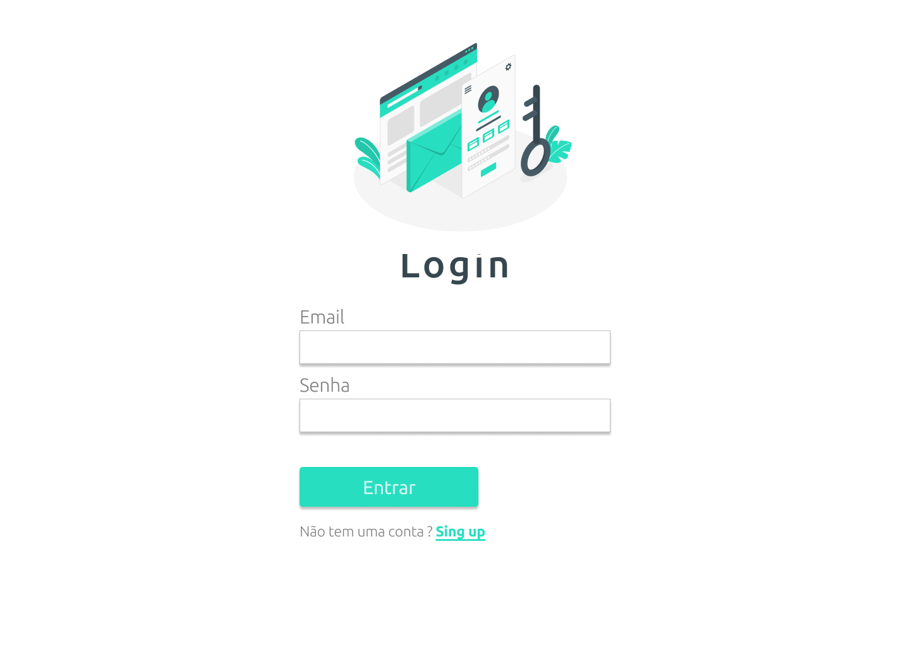
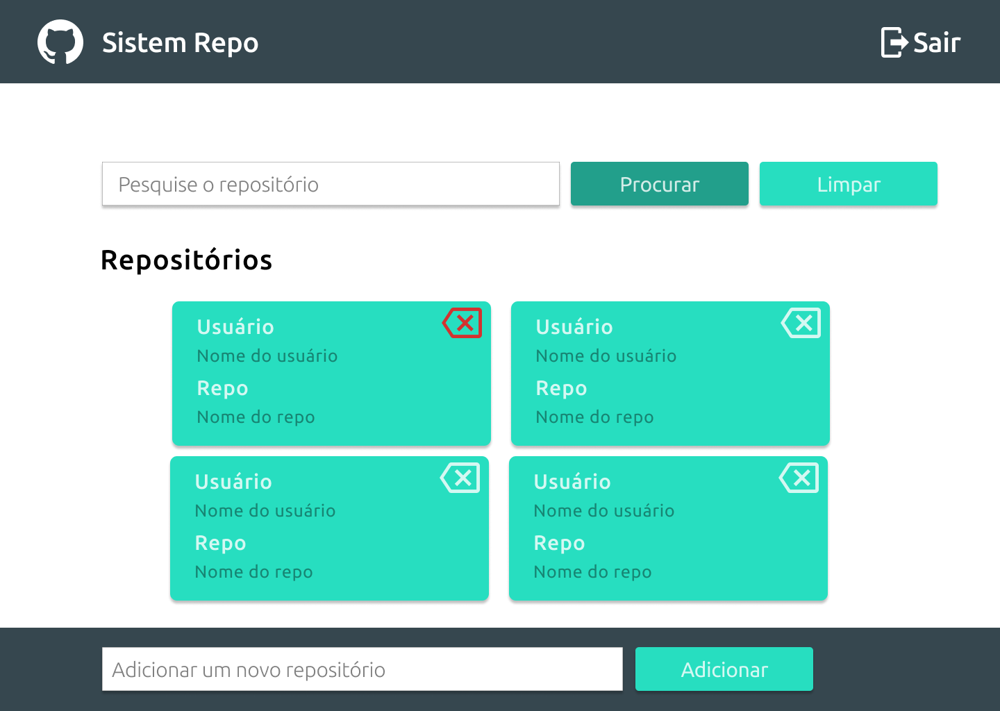
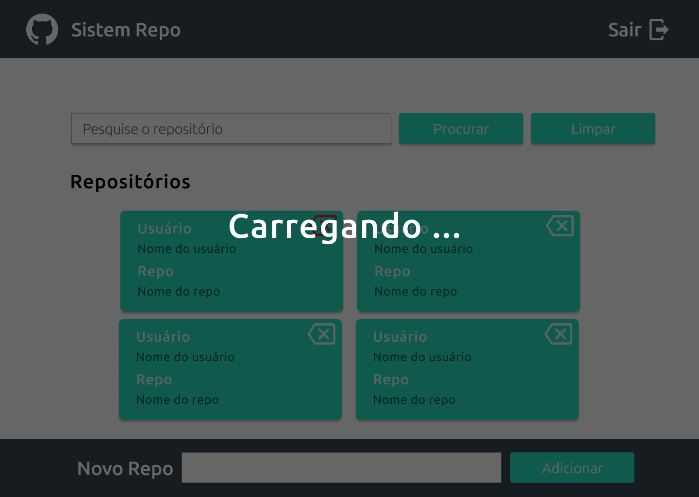
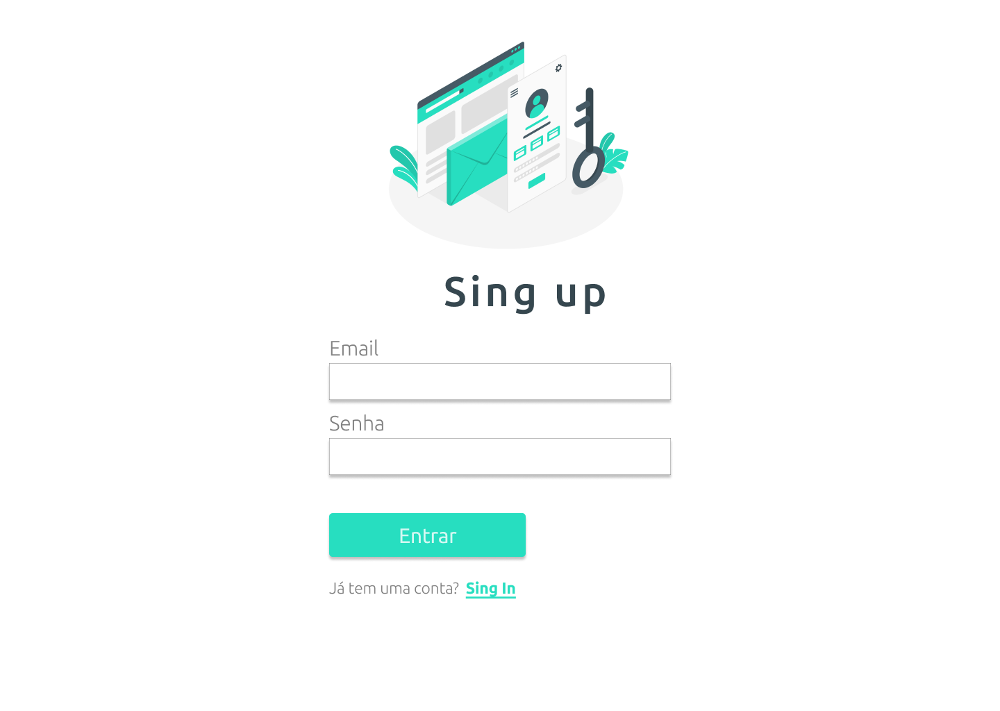
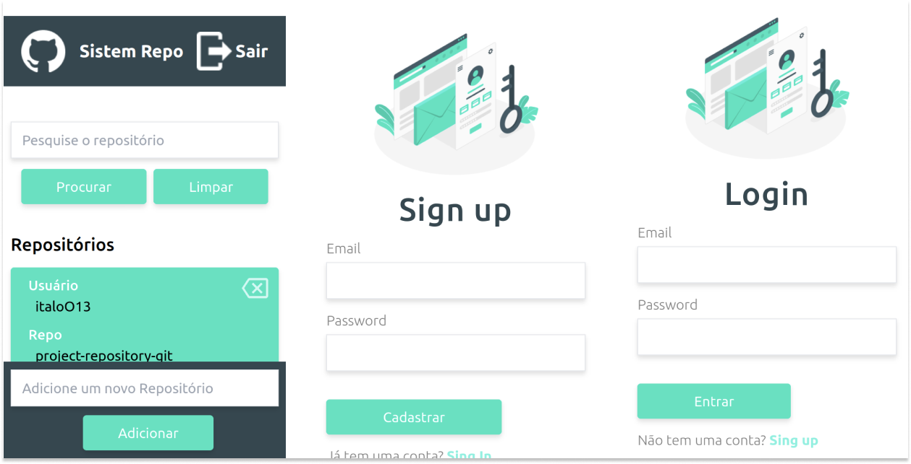
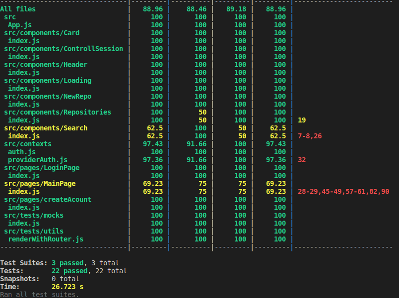
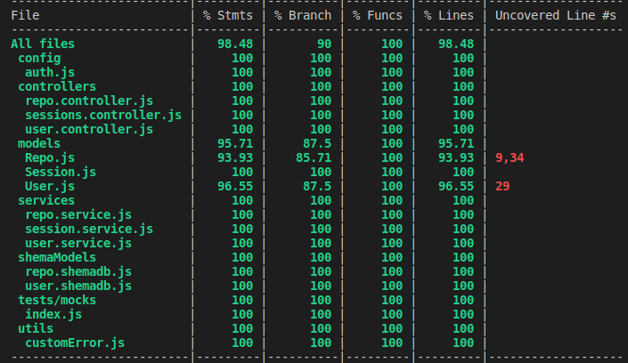
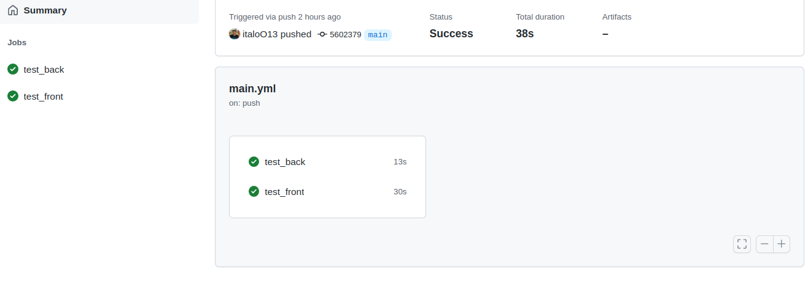
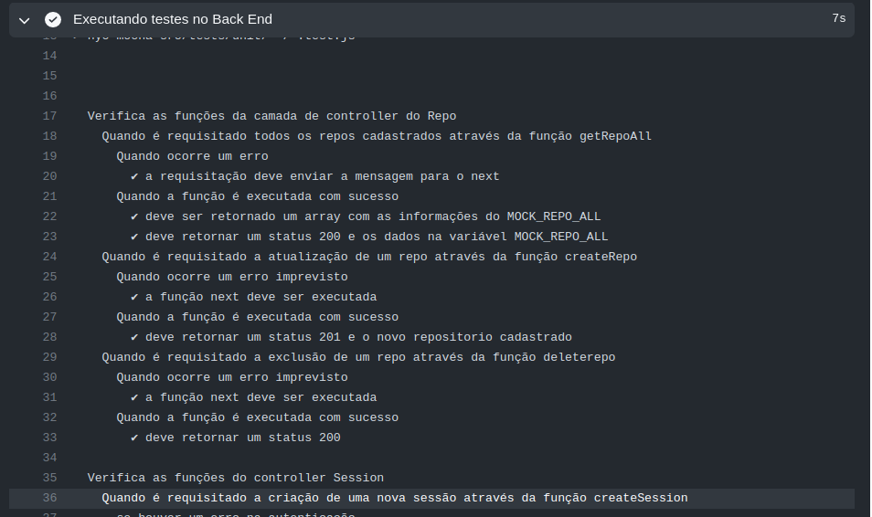

<h1 align="center">
     <a href="#" alt="site de despesa"> Repositórios GITHUB- Projeto Full Stack</a>
</h1>

<h3 align="center">
    Este projeto teve o objetivo de desenvolver um CRUD para cadastro de repositórios do github desde a criação do design, frontEnd, backEnd, testes e deploy.
</h3>

<h4 align="center">
	🚧   Em andamento 🚀 🚧
</h4>

---

## 💻 Sobre o projeto

 ### A aplicação tem as funcionalidades de:

  - Controle de acesso
  - Cadastro de usuários
  - Login com JWT
  - CRUD para cadastro de repositórios
  - Filtrar repositórios especificos
  - Responsividade para mobile

  ### Foi utilizado as seguintes tecnologias:
    Estilização
    - Figma
    Front End
    - Tailwind
    - React js
    - ContextApi
    - React Testing Library :  32 testes com cobertura de 88%
    Back End
    - Node js
    - JWT
    - Mocha, chai , sinon : 81 testes com cobertura de 98%
    - MongoDB e mongoose
    - Arquitetura MSC
    CI/CD
    - Github Actions

---

##  🎨 Front End - [figma](https://www.figma.com/file/Cq2ADp2GujSsEcO4Qf3yjJ/Dev-Repo?node-id=0%3A1)

Comandos para iniciar Front End

```
$ cd dev-repo-web
$ npm start

```

## Desktop

  ## Login

  

  ### Home

  
  
  ### Loading

  

  ### Sing Up

  


## Mobile

  

---

## 🛠 BackEnd

Para executar localmente o backend use os seguintes comandos:

```
$ cd dev-repo-server
$ npm start
```

### Metodo de session

|Methodo|Rota|Descrição|
| ------ | ------ | ----- |
|post|/session|Retorna um token de acesso|

Formato de requisição para o POST:

```
{
	"email":"MichaelSchumacher@gmail.com",
	"password":"123456"
}
```

### Metodos da rota Users

|Methodo|Rota|Descrição|
| ------ | ------ | ----- |
|get|/user|Retorna todos os usuários cadastrados|
|get|/user/:id|Retorna um usuário cadastrado com base no id informado|
|post|/user|Cadastra um novo usuário|
|put|/user/:id|Atualiza informações de um usuário com base no id informad|
|delete|/user/:id|Apaga usuário logado na sessão|

Formato de requisição para o POST e PUT:
```
{
	"email":"MichaelSchumacher@gmail.com",
	"password":"123456"
}
```

### Metodos da rota Repo

|Methodo|Rota|Descrição|
| ------ | ------ | ----- |
|get|/repo/:userId|Retorna todos os repositórios feitos pelo usuário logado|
|get|/repo/:userId/search?q=|Retorna os posts que contenham a palavra pesquisada|
|post|/repo/:userId|Cadastra um novo repositório|
|delete|/repo/:userId/:repo|Apaga um repositório a partir do id|

Formato de requisição para o POST e DELETE:
```
{
	"name":"italoO13/project-repositgory-ggit",
	"url":"https://github.com/itagloO13/project-repository-git"
}
```

---

## ⚙️ Testes | CI/CD

### Front End
  Foi desenvolvido 32 testes unitários utilizado a biblioteca react testing libary, caso deseje rodar os testes localmente execute os seguintes comandos:

```
$ cd dev-repo-web
$ npm test
```
Cobetura de teste:



<br>
<br>

### Back End
  Foi desenvolvido 81 testes unitários utilizado as biblioteca mocha, chai e sinon, para rodar os testes localmente execute os seguintes comandos:

```
$ cd dev-repo-server
$ npm test
```
Cobetura de teste:



<br>
<br>

### Continuous integration

Foram utilizado os testes unitários como pré-requisito para fazer qualquer push ou pull_request na branch main a partir do github Actions

Imagens do Github Actions rodando:



<br>
<br>



---

### Deploy - Em Andamento...

<br>
<br>

---

## Lições Aprendidas

- Utilizar a técnica TDD - Durante o desenvolvimento dos testes encontrei muitos bugs no código.
- Importância do Design - Foi mais simples fazer o front utilizando um figma como modelo.
